# Project Bridgehead Post-Incident and Architectural Defense Report

Prepared for the Project Bridgehead capstone environment and repository as a consolidated post-incident record, technical assessment, and architectural defense report.

All raw attack reports, scan PDFs, exported logs, screenshots, custom scripts, and extracted CherryTree HTML exports referenced in this report are preserved in the project repository or in the current workspace snapshot. Where an artifact exists only as an image, the report treats it as screenshot-based evidence. Where an artifact exists as raw text, CSV, Markdown, or extracted HTML, the report treats it as primary evidence and correlates it with matching screenshots where available.

Evidence handling note: the separate archive `1/4/hacker.ctb_HTML.7z` was later materialized in the workspace, extracted, and reviewed. That extracted HTML export materially strengthened the evidentiary basis for this report by preserving rendered note pages, embedded images, and raw Cowrie or Splunk event text that was only partially visible in the original note-tree structure.

---

## Table of Contents

1. [SECTION 1: INFRASTRUCTURE & SETUP](#section-1-infrastructure--setup)
2. [SECTION 2: RED TEAM OPERATIONS (THE ATTACK)](#section-2-red-team-operations-the-attack)
3. [SECTION 3: BLUE/PURPLE TEAM OPERATIONS (THE DEFENSE)](#section-3-bluepurple-team-operations-the-defense)
4. [Closing Assessment](#closing-assessment)

---

## SECTION 1: INFRASTRUCTURE & SETUP

### 1.1 Executive Infrastructure Narrative

This environment was not a generic three-VM practice lab. It was a deliberately engineered cyber range designed to model the security problems that emerge when an Internet-facing application tier, an internal service tier, and a Windows administrative or data tier are connected without sufficiently strong trust boundaries. The project objective was twofold: first, to prove a realistic attack chain across multiple hosts; second, to show how layered defensive controls such as firewall segmentation, IDS, SIEM correlation, deception telemetry, endpoint monitoring, and AI-assisted enrichment can be integrated into the same range.

The resulting setup is best described as a small-scale enterprise simulation built on a mini-PC hypervisor but structured according to real network-security concepts: a WAN-facing edge, a DMZ containing exposed services, an internal security-monitoring segment, and separate host roles distributed across Linux and Windows systems. That architectural choice is important because it changes the meaning of the attack evidence. The compromise demonstrated in later sections was not just a single-host web exploit. It was a failure of application design, credential placement, internal trust segmentation, and host-hardening discipline across an intentionally tiered environment.

For accuracy, the report uses the current repository evidence as the baseline: the pentest report, the technical appendix, the extracted CherryTree notebook, the architecture document, the Splunk/Cowrie evidence, the Nessus results, and the remediation documents. Where the project evolved from a vulnerable legacy state toward a more hardened target state, both states are described explicitly rather than blurred together.

### 1.2 Physical Host, Hypervisor, and Administration Model

The cyber range ran on an EliteMini host system using Linux Mint 22.3 as the base operating system. The host hardware and software stack mattered because the project intentionally balanced realism against the finite resource limits of a compact workstation.

Host platform details recorded in the project materials:

- host OS: Linux Mint 22.3
- CPU: AMD Ryzen 7 8745H with Radeon 780M
- GPU: Radeon 780M integrated graphics
- RAM: 32 GB physical memory, with roughly 29.8 GiB usable for the working environment

Virtualization was provided by KVM/QEMU and administered through Virt-Manager. That combination is relevant for two reasons. First, it made the environment reproducible and easy to segment into distinct guest roles. Second, it gave the team fine-grained control over virtual NIC attachment, subnet placement, and host resource allocation. The guests were not simply spun up as isolated demonstrations; they were arranged as interdependent nodes whose communication patterns were part of the exercise itself.

Remote administration was performed with RustDesk. This administrative pattern shows up in the broader screenshot record and is consistent with a lab workflow where the operator needed to move quickly between Linux shells, browser sessions, Windows desktops, pfSense administration, and security tooling without relying on direct physical console interaction.

### 1.3 Official Lab Identity and Repository Framing

From a reporting standpoint, that means:

- the offensive chain is documented as a Project Bridgehead red-team exercise against a vulnerable three-tier environment
- the monitoring, AI, and architectural hardening work sit in the same evidentiary chain rather than in a separate unrelated project
- the report is written as a post-incident and architectural defense record, not just a standalone pentest narrative

### 1.4 Network Topology and Segmentation Model

The architecture evidence establishes three major network zones:

| Zone | Purpose | Network | Key Assets |
| --- | --- | --- | --- |
| WAN edge | External entry and routing boundary | external-facing | pfSense WAN interface |
| DMZ | Exposed and semi-exposed operational services | `10.0.10.x` | `10.0.10.104`, `10.0.10.105`, `10.0.10.106` |
| Internal / SOC network | Monitoring, management, and log aggregation | `10.0.20.x` | `10.0.20.101`, `10.0.20.103` |

This was not a flat lab. The perimeter was enforced by pfSense, which acted as the master gatekeeper between WAN-facing exposure, the DMZ, and the internal security segment. That routing and firewall layer is one of the most important missing details in the earlier high-level summary, because without it the environment looks like a handful of compromised VMs rather than a segmented network-security design.

The DMZ housed the assets intended to be attacked, monitored, or used as stepping stones. The internal network housed centralized monitoring and additional Windows telemetry. This setup made it possible to test not only exploitation, but also questions of segmentation quality:

- could a public compromise stay contained inside the DMZ?
- would credentials exposed on one host allow movement to another?
- would logs from exposed hosts reach the internal monitoring enclave?
- could deception and logging detect behavior that the firewall itself allowed through?

Those are enterprise questions, not merely CTF questions, and the pfSense-centered topology is what made them testable.

### 1.5 Host Inventory and Functional Roles

The current architecture material and the offensive evidence together support the following working host map.

#### DMZ Hosts

**System 1 - Ubuntu 24.04 Web and Deception Node (`10.0.10.105`)**

This system played a dual role in the legacy environment:

- public-facing vulnerable bank application
- Cowrie honeypot exposure on TCP/2222
- Splunk forwarding source
- Wazuh agent source

Operationally, it is the most important first-hop system in the lab. It is where the real business-impact compromise began through the vulnerable avatar upload workflow, and it is also where non-productive SSH interaction was intentionally recorded through Cowrie.

**System 2 - Ubuntu 24.04 Internal Backend Node (`10.0.10.102`)**

The offensive evidence shows this system functioning as the second-tier Linux target reached after secrets were recovered from System 1. In the current architecture document, the DMZ backend role is also represented by a Linux host supporting the website backend. Even though some documents reference `10.0.10.104` in the target-state model, the actual attack evidence for the legacy path is explicit about `10.0.10.102` as the internal backend compromise target. This distinction should be preserved because the report documents the attack chain that actually occurred, not only the later cleaned-up design.

The important operational role of System 2 in the evidence set is:

- backend or internal application-support host
- SSH-reachable Linux pivot target after secret disclosure
- local privilege-escalation stage via insecure root-owned shell script
- platform used to validate shell-to-meterpreter workflow after lateral movement

**System 3 - Windows 10 Jump or Data-Tier Host (`10.0.10.106`)**

System 3 functioned as the Windows administrative or data-tier system discovered after the initial Linux compromises. It later served additional monitoring and AI-related roles in the broader project materials, including Splunk forwarding, Wazuh agent placement, and support for the DistilBERT-related workflow. In the attack narrative, however, its importance comes from service exposure and exploitability:

- Windows 10 fingerprinted by Nmap
- RPC, SMB, HTTPAPI, and Icecast exposed internally
- reachable after internal discovery from the compromised path
- vulnerable to Icecast exploitation through Metasploit

#### Internal / SOC Hosts

**Ubuntu monitoring node (`10.0.20.101`)**

The internal Ubuntu monitoring host is described in the architecture evidence as running:

- Splunk Enterprise
- Wazuh Manager
- `vsftpd 2.3.2`

Its role in the overall architecture is significant because it forms the log-aggregation and analyst-facing side of the environment. It receives or correlates telemetry from the DMZ, including Cowrie-derived events and Windows log activity. It is also a high-value internal node because concentration of monitoring and management capability on one internal host can improve visibility but also raises blast-radius concerns if that host becomes exposed.

**Windows internal host (`10.0.20.103`)**

The architecture evidence identifies a Windows host on the internal network acting as an additional telemetry source, with Wazuh and Splunk forwarding functions. In practical terms, this host helps show that the SOC side of the lab was not limited to Linux log analysis.

### 1.6 pfSense as the Perimeter Control Plane

pfSense was not a cosmetic infrastructure component. It was the core trust-enforcement point of the range. The environment depended on pfSense to separate WAN, DMZ, and internal flows and to act as the place where policy, NAT, and inspection decisions converged.

From an engineering perspective, pfSense served four critical functions:

1. **Routing between zones**
	 It connected external access, the DMZ systems, and the internal monitoring segment.
2. **Firewall policy enforcement**
	 It controlled which services could be reached from WAN and which flows were allowed between DMZ and internal systems.
3. **NAT and exposure management**
	 It defined which public-facing or forwarded services were intentionally published.
4. **Inspection host for IDS or IPS capability**
	 It provided the natural control point for Suricata-based detection at the network boundary.

This matters because the later compromise chain did not happen in the absence of a firewall. It happened in an environment where permitted flows, weak application design, and insufficient trust separation still allowed the attacker to move from exposed services toward internal systems. That is a much stronger architectural lesson than a flat-network breach.

### 1.7 Suricata and Deep Packet Inspection Role

The user clarification is correct that the earlier summary underplayed the Layer 7 defensive posture. The project materials support Suricata as part of the intended defensive stack on pfSense using ETOpen-style IDS logic. While the current repository snapshot is stronger on Splunk and Cowrie than on standalone Suricata screenshots, the design role is still important enough to state explicitly.

Suricata's place in this architecture is best described as follows:

- deployed at the perimeter or inter-zone inspection point on pfSense
- intended to inspect HTTP and other allowed traffic that a port-based firewall would not block by default
- useful for catching exploit signatures, suspicious upload patterns, abnormal headers, or exploit-delivery traffic
- complementary to host-level logs and SIEM correlation rather than a replacement for them

This is especially relevant in a lab where the decisive exploit was an application-layer weakness. A conventional firewall can allow TCP/80 or TCP/443 and still fail to stop a malicious upload. That is exactly where IDS or IPS controls become relevant because application-layer abuse can travel over otherwise permitted network paths.

### 1.8 Offensive Tooling Present in the Setup

The red-team environment was not limited to Metasploit. The pentest report and technical appendix show a broader offensive workflow that should be documented as part of the setup because tool availability shapes the attack methodology.

#### Attacker Platform

- Kali Linux as the offensive operating environment

#### Reconnaissance and Profiling

- Nmap for port scanning, service detection, and OS fingerprinting
- Nikto for web hardening review and exposed content discovery
- searchsploit for exploit research, including Icecast validation

#### Web Exploitation Workflow

- manual HTTP testing
- `curl` for direct request validation
- OWASP ZAP and Caido as interception and replay-capable web tooling present in the evidence set
- custom PHP web shells for upload-based command execution validation

#### Post-Exploitation and Pivoting

- Metasploit Framework
- Meterpreter
- shell-to-meterpreter session upgrade workflow

This toolchain matters because it demonstrates that the lab was exercised across the full kill chain: discovery, application review, exploitation, credential abuse, lateral movement, and post-exploitation validation.

### 1.9 Blue-Team and Telemetry Pipeline Present in the Setup

The blue-team side of the setup was equally substantial and should be documented as infrastructure rather than an afterthought. The evidence across the architecture document, Splunk material, and AI integration shows a defense stack with several layers.

#### Deception and Host Telemetry

- Cowrie SSH honeypot on TCP/2222 at `10.0.10.105`
- Wazuh agents on exposed and internal systems
- Windows event forwarding into the monitoring workflow
- Splunk forwarders on relevant hosts

#### SIEM and Collection Paths

- Splunk Enterprise deployed on the internal monitoring segment
- Splunk Universal Forwarder pathways
- HEC ingestion on port `8088`
- Splunk REST API access on port `8089`
- Splunk forwarder traffic associated with port `9997`

#### Vulnerability and Hardening Validation

- Nessus used for host-level audit evidence
- host firewalling and Windows endpoint telemetry used as part of the hardening story

The engineering point is that the lab did not only prove exploitation. It also proved that logs, deception events, and classification outputs could be centralized and reviewed from a segregated internal location.

### 1.10 AI Integration as a First-Class Architectural Component

The DistilBERT-based classifier is not a generic add-on. It is one of the distinguishing architectural elements of the project. The model was fine-tuned to classify Cowrie command activity into behavior categories such as:

- `recon_bot`
- `malware_dropper`
- `human_interactive`

In operational terms, the AI pipeline performed the following chain:

1. Cowrie captured SSH interaction on the deception service.
2. Logs were shipped or made available to Splunk.
3. Custom Python scripts queried Splunk through the REST API.
4. DistilBERT classified command behavior.
5. The enriched events were sent back into Splunk via HEC for analyst consumption.

This means the environment combined deception, log shipping, enrichment, and analyst-facing SIEM views inside the same project. That is materially more advanced than a simple honeypot or a static machine-learning demonstration.

### 1.11 Legacy Stack Versus Target-State Stack

One of the most important interpretive points in the repository is that it contains both the **legacy vulnerable state** and the **hardened target state**. These should not be collapsed into one narrative.

#### Legacy State

The compromised path documented by the red team is the legacy state:

- public-facing vulnerable bank app on Ubuntu
- insecure file upload leading to remote code execution
- secrets and credential material exposed on the compromised tier
- weak internal trust path from web tier to backend tier
- exploitable Windows service surface after internal enumeration

#### Target-State Remediation Direction

The repository also documents a secure-state direction built around:

- Nginx TLS edge behavior
- Node.js or Express backend over HTTPS
- MongoDB with TLS and authorization
- stronger service-token and cookie handling
- upload normalization, storage isolation, and safe retrieval model
- tighter host hardening and segmentation

This distinction is essential to honest reporting. The red-team evidence proves what the legacy path allowed. The architecture and remediation evidence show what the environment was moving toward after the incident. Treating the target state as if it were the original condition would erase the value of the project.

### 1.12 Security-Architecture Relevance of the Setup

Even in the setup section, the environment already shows the engineering conditions that later become visible in exploitation.

- compromise of a public node can spill into internal trust paths,
- attacker-controlled input on the public application can become a route to server-side execution,
- unsafe file handling, secrets placement, and weak separation create systemic risk,
- exposed paths, weak headers, permissive services, and weak SSH settings reflect baseline hardening problems,
- exposed credentials remain usable across tiers, showing that identity material is over-trusted,
- logging and detection can exist without keeping pace with exploitation.

This is one of the reasons the lab reads as a serious capstone rather than a simple exploit demo: the infrastructure itself is designed to expose how application flaws, secrets hygiene, firewall policy, service exposure, and detection maturity interact as one system.

### 1.13 Detailed Tool Matrix

To make the setup explicit and technically concrete, the following matrix consolidates the evidence-backed tool stack referenced across the pentest report, technical appendix, architecture notes, and monitoring artifacts.

| Layer | Tool or Platform | Role in the Environment |
| --- | --- | --- |
| Virtualization | KVM/QEMU | Hypervisor engine for guest systems |
| VM Management | Virt-Manager | Guest lifecycle and virtual network management |
| Host OS | Linux Mint 22.3 | Base platform for the mini-PC lab |
| Remote Admin | RustDesk | Remote management of host and guests |
| Perimeter | pfSense | WAN, DMZ, and internal routing and firewalling |
| IDS/IPS | Suricata | Deep packet inspection and alerting role on pfSense |
| Attacker OS | Kali Linux | Red-team operations platform |
| Recon | Nmap | Port, service, and OS discovery |
| Web Review | Nikto | Web baseline and exposure discovery |
| Web Interception | OWASP ZAP | HTTP review and attack-path support |
| Web Interception | Caido | Request replay and exploit-driving workflow |
| Exploitation | PHP web shell payloads | Upload-based RCE validation |
| Exploitation | Metasploit Framework | Lateral movement and exploit execution |
| Post-Exploitation | Meterpreter | Interactive session management |
| Audit | Nessus | Host-level vulnerability and hardening audit |
| Deception | Cowrie | SSH honeypot on port `2222` |
| SIEM | Splunk Enterprise | Centralized log aggregation and analysis |
| Log Forwarding | Splunk Universal Forwarder | Host-to-Splunk telemetry forwarding |
| Enrichment Ingest | Splunk HEC | Event injection on `8088` |
| API Control | Splunk REST API | Programmatic query and enrichment workflow on `8089` |
| Endpoint Monitoring | Wazuh | Host-based monitoring and agent telemetry |
| AI | DistilBERT | Behavioral classification of Cowrie command input |
| AI Runtime | Python scripts | REST query, inference, and HEC write-back workflow |

### 1.14 Evidence Placement Policy for This Report

This report is intentionally written as a long-form technical narrative rather than a screenshot dump. To preserve structure and evidentiary discipline:

- Section 1 focuses on architecture, setup, and control placement.
- Section 2 focuses on the actual red-team attack chain.
- Section 3 focuses on defensive visibility, monitoring, AI, and hardening response.
- Later severity references and standards mappings are added only where they improve technical interpretation rather than as cosmetic labels.

That approach keeps the report readable while still preserving the depth expected of a capstone that is meant to stand up as a serious engineering document.

---

## SECTION 2: RED TEAM OPERATIONS (THE ATTACK)

### 2.1 Rules of Engagement, Adversary Scope, and Analytical Frame

The red-team chapter should be read as a structured kill-chain analysis rather than a loose collection of exploitation screenshots. The Rules of Engagement matter because they determine what conclusions are defensible. The primary authorized attack surface was the public web application on `10.0.10.105`. Automated SSH brute-forcing was explicitly out of scope. That means the report must distinguish between three different classes of hostile activity observed in the environment:

1. **productive compromise activity** that actually advanced the breach path,
2. **supporting reconnaissance and validation activity** that informed attacker decisions, and
3. **deception-path activity** captured by Cowrie on TCP/2222 that generated useful telemetry but was not the primary business-impact route.

This distinction is what prevents the report from becoming sensationalized. The public-facing upload workflow was the productive route. The Cowrie path was real and operationally useful, but it functioned as monitored attacker interaction rather than the decisive intrusion mechanism.

### 2.2 Structured Kill-Chain Summary

The observed attack chain unfolded across three systems and several distinct decision points.

| Kill-Chain Phase | Target | Attacker Action | Decision Point | Principal Security Meaning |
| --- | --- | --- | --- | --- |
| Reconnaissance | `10.0.10.105` | Nmap, service discovery, web hardening review | Focus on HTTP service instead of SSH brute-force due scope and business value | External surface was narrow but still sufficient for compromise |
| Deception validation | `10.0.10.105:2222` | Interactive SSH-style probing against Cowrie | Confirmed decoy behavior; not treated as primary route | Monitoring existed, but prevention did not stop the web path |
| Web attack-path exploration | `10.0.10.105` | SQL injection and traversal testing | Abandoned when evidence did not support decisive exploitation | Tester used evidence discipline rather than inflating weak paths |
| Initial access | `10.0.10.105` | Insecure file upload -> PHP web shell -> command execution | Selected because it converted application access into server execution | Critical application-layer failure |
| Credential access | `10.0.10.105` | Read `.env`, `credentials.txt`, related files | Use stolen secrets instead of noisy credential attacks | Secrets placement amplified breach impact |
| Lateral movement | `10.0.10.102` | SSH with recovered `deploy` credentials | Valid credentials made pivot low-noise and reliable | Internal trust boundary failed |
| Privilege escalation | `10.0.10.102` | Abuse of insecure root-owned shell script | Escalate because local permissions were weaker than expected | Host hardening failed after pivot |
| Session stabilization | `10.0.10.102` | Upgrade shell to Meterpreter | Create durable post-exploitation control | Backend compromise matured beyond transient access |
| Internal discovery | `10.0.10.106` | Nmap scan, service validation, exploit research | Select Icecast because it offered a known exploit path | Downstream service exposure created a second executable route |
| Internal exploitation | `10.0.10.106` | Metasploit Icecast header exploit | Chosen as the most direct reachable RCE path | DMZ containment and service hardening remained insufficient |

For System 1, this was not a one-bug story. It was a stacked web-application and exposure failure involving executable user-controlled content, unsafe upload design, weak secret handling on the public tier, and a web hardening baseline that reduced attacker cost.

### 2.3 Phase One: External Reconnaissance Against System 1 (`10.0.10.105`)

The attack began with controlled discovery against the public host. The early scans identified a deliberately narrow exposure set: TCP/80 for the web application and TCP/2222 for the SSH-like service later confirmed to be Cowrie. TCP/22 and TCP/443 were closed during the early scanning phase. This mattered because it forced the attacker to make an early strategic choice. There was no legitimate exposed administrative SSH path and no HTTPS application flow to broaden the surface. The viable public entry remained the web application.

Nmap and service-detection output also tied the host to an Ubuntu or Linux web tier with Apache and PHP indicators. Nikto then added application-level context: missing `HttpOnly` on `PHPSESSID`, absent `X-Frame-Options`, accessible `/config.php`, and directory indexing under `/includes/`. None of those items independently created code execution, but together they advertised a weak security baseline and justified further web-layer testing.

#### Attacker Decision Point

At this stage, the attacker had two visible paths:

- interact with TCP/2222 and see whether it exposed a usable SSH service,
- or prioritize the public application because it aligned better with scope and likely business impact.

The operator did both in a disciplined order: validate the unusual high-port service, then return to the web application as the main exploitation path.

#### Severity and Standards Context

- **OWASP relevance:** A05 Security Misconfiguration, A01 Broken Access Control, A09 Security Logging and Monitoring Failures (in the sense that logging existed but had not yet proven preventive value)
- **CWE relevance:** CWE-16 configuration weaknesses as a general category for web-hardening gaps
- **CVSS treatment:** these recon-stage weaknesses are not the core critical finding; they lower attack cost and improve attacker confidence rather than directly delivering shell access

After identifying TCP/2222 during the initial Nmap phase, the operator also interacted directly with the SSH-like service and confirmed that it behaved as a Cowrie honeypot rather than a normal administrative endpoint.

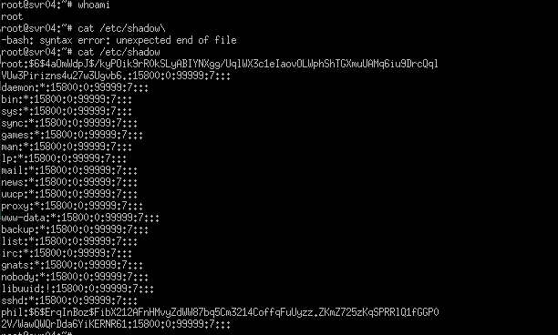

*Figure 8: Early SSH interaction with the Cowrie service on TCP/2222 after Nmap discovery, showing command execution attempts such as `whoami` and `cat /etc/shadow` against the deception endpoint on System 1.*

### 2.4 Phase Two: Attack-Path Triage on the Web Tier

The next step was not immediate exploitation but attack-path triage. This is important because mature offensive work is often defined by what the operator decides *not* to overstate. The notes show at least two explored but non-decisive vectors before the main exploit path was chosen: SQL injection against the login surface and directory traversal against the web root.

The SQL injection tests demonstrate that the authentication flow was probed for classic login-bypass behavior. The evidence, however, does not support a confirmed injection result. Likewise, the directory traversal attempt returned `404 Not Found`, which means that in the tested form it did not produce the file disclosure needed for escalation.

These explored paths still matter because they reveal attacker reasoning. They show that the operator checked common high-yield web weaknesses first, did not get a conclusive exploitation result, and then moved toward the upload workflow once the evidence suggested it was the most promising path.

#### Attacker Decision Point

The decision here was to abandon ambiguous or non-productive paths and commit effort to the upload mechanism, where the probability of converting a normal user workflow into code execution was materially higher.

#### Severity and Standards Context

- **OWASP relevance:** A03 Injection and A05 Security Misconfiguration are relevant as tested categories, but not confirmed findings for these specific two branches
- **Reporting discipline:** these remain attack-path explorations, not headline findings

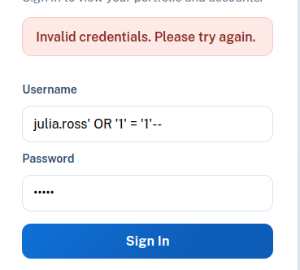

*Figure 9: First SQL injection test capture against the login surface, preserved as evidence of manual path exploration rather than a confirmed exploit result.*

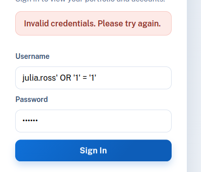

*Figure 10: Second SQL injection test capture from the same branch, showing the assessment's evidence discipline in recording explored but non-decisive attack paths.*

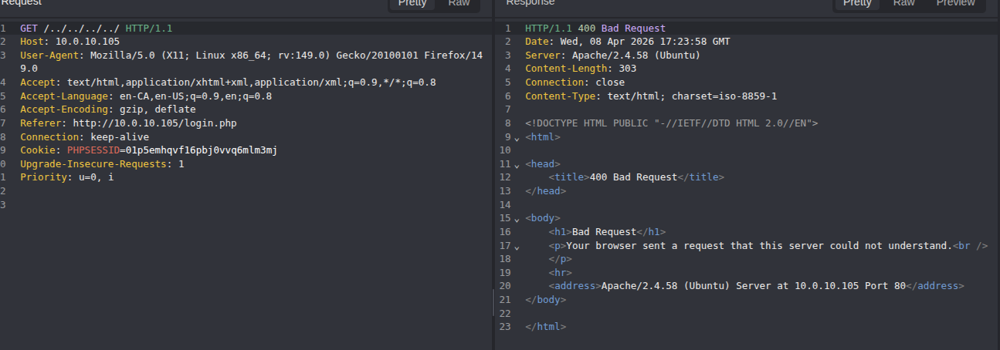

*Figure 11: Directory traversal attempt resulting in a `404 Not Found`, useful because it narrows the report to the actual exploit chain instead of overstating every tested vector.*

### 2.5 Phase Three: Initial Access Through Insecure File Upload

The decisive initial-access event was the avatar upload workflow on `/profile.php`. This is the central red-team finding because it converted normal application reachability into remote code execution on the public host.

The operator prepared a minimal PHP command shell, uploaded it through the avatar mechanism, and then triggered execution from the uploads path. The important engineering point is not only that the file executed, but why it executed: the legacy design trusted extension handling and file placement instead of implementing MIME validation, decode-and-rewrite normalization, storage isolation, and controlled file serving. In other words, this was both an implementation flaw and a design flaw.

#### Finding Classification

- **Primary finding ID:** PT-01
- **OWASP Top 10:** A03 Injection, A04 Insecure Design, A08 Software and Data Integrity Failures
- **CWE:** CWE-434 Unrestricted Upload of File with Dangerous Type
- **CVSS v3.1:** `9.8` (Critical)
- **Business effect:** external user path converted into shell access on the public host

#### Attacker Decision Point

Once the upload path executed, the attacker no longer needed speculative testing. The workflow had already crossed the most important threshold in the assessment: code execution as `www-data` on the Internet-facing system.

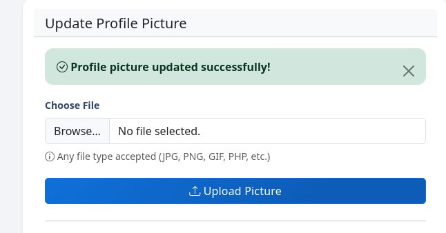

*Figure 12: Upload-stage screenshot showing the malicious avatar submission that initiated the insecure file upload exploit chain.*

### 2.6 Phase Four: Command Execution, Local File Access, and Secret Harvesting

The Caido replay evidence is what transforms the upload bug from a theoretical claim into a forensically rich exploitation record. The screenshots show the attacker using the uploaded shell to execute commands, enumerate the application directory, read local files, and ultimately recover sensitive material such as `.env` and `credentials.txt`.

This phase is where the breach became multi-system in character. Remote code execution alone is already a critical event. But once configuration files and credential artifacts were readable from the public host, the attacker no longer needed to force a second compromise from scratch. The environment effectively pre-positioned the secrets required for lateral movement.

#### Finding Classification

- **Primary finding ID:** PT-02
- **OWASP Top 10:** A07 Identification and Authentication Failures, A01 Broken Access Control, A05 Security Misconfiguration
- **CWE:** CWE-200 Exposure of Sensitive Information, CWE-798 Use of Hard-coded Credentials or equivalent unsafe secret placement pattern
- **CVSS v3.1:** `9.1` (Critical) for exposed internal secrets with cross-tier impact
- **Business effect:** public compromise immediately gained access to reusable internal identities and service details

#### Attacker Decision Point

At this point the attacker chose the lowest-noise, highest-confidence pivot: use the stolen `deploy` credentials against the backend host rather than continue experimenting from the public shell alone.

*Figure 13: Caido replay proving the uploaded avatar became an execution path by returning `www-data` from a `whoami` command issued through the web shell.*

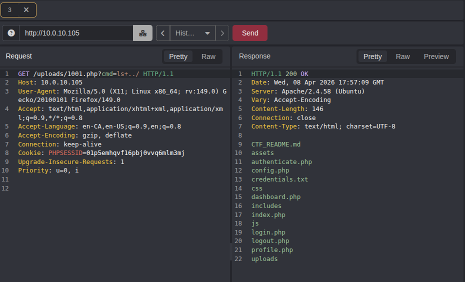

*Figure 14: Caido replay used to enumerate the application directory and confirm the presence of sensitive files such as `.env`, `credentials.txt`, and the legacy PHP application source.*

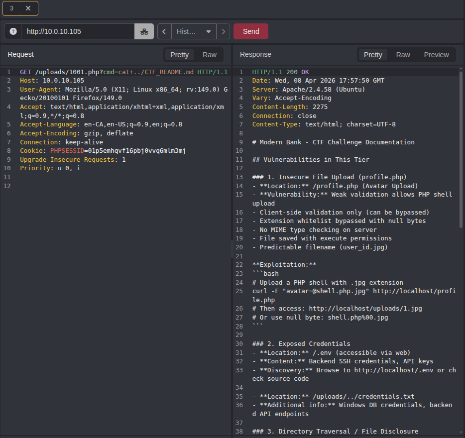

*Figure 15: Caido replay retrieving the embedded challenge documentation, which itself describes the insecure upload path and downstream credential exposure, reinforcing the lab's intentionally vulnerable design.*

*Figure 16: Caido replay demonstrating privileged file-read attempts through the web shell; even where a specific request returned no content, it shows the level of post-upload control the attacker had achieved.*

*Figure 17: Caido replay extracting `/etc/passwd`, confirming that the shell could access local filesystem content beyond the immediate web application files.*

*Figure 18: Caido replay retrieving `credentials.txt`, which exposed backend SSH credentials, backend admin CGI details, and Windows database credentials in a form directly usable for lateral movement.*

### 2.7 Phase Five: Credentialed Lateral Movement to System 2 (`10.0.10.102`)

The transition from System 1 to System 2 is one of the strongest parts of the evidence set because it shows the attacker moving through the environment using valid credentials rather than brute-force or vulnerability guesswork. That distinction matters operationally. It means the second host accepted a legitimate identity that had become attacker-controlled. In enterprise terms, this is exactly the kind of event that turns an application incident into a broader domain or environment problem.

The `deploy` credential recovered from the compromised web tier was used to access `10.0.10.102` over SSH. The backend host therefore failed not because SSH itself was internet-brute-forced, but because the preceding host compromise exposed a trusted account with cross-tier value.

#### Finding Classification

- **Primary finding linkage:** extension of PT-02, with direct lateral-movement consequence
- **Host-security interpretation:** credentialed lateral movement using a trusted internal identity after secret exposure on System 1
- **CWE relevance:** CWE-200 and CWE-798 remain the best fit for the root cause; the SSH acceptance itself is not the primary flaw, the exposed secret is
- **CVSS handling:** not separately rescored from PT-02 in the imported report set, but operational impact is critical because it expands compromise into the internal tier

#### Attacker Decision Point

The decision to use valid `deploy` credentials rather than continue acting only through the web shell reduced operational noise, improved reliability, and created a path to local privilege escalation on a more trusted host.

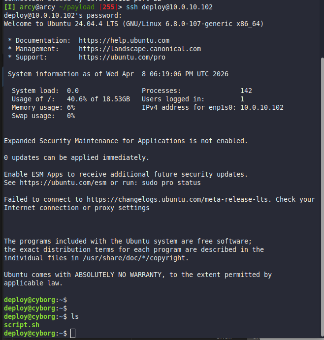

*Figure 21: Backend SSH access to `10.0.10.102` after credentials were recovered from the compromised frontend, showing that the second-tier host accepted the stolen `deploy` account.*

### 2.8 Phase Six: Local Privilege Escalation and Session Stabilization on System 2

Compromise of the backend host did not stop at user-level SSH access. The notes and screenshots show the attacker abusing an insecure root-owned shell script with unsafe permissions, effectively turning authenticated foothold into elevated local control. This is an important separate architectural lesson. Even if the public host had leaked credentials, a hardened backend could still have slowed or stopped the breach. Instead, System 2 offered a local privilege-escalation path that accelerated post-compromise control.

The Metasploit-driven shell-to-meterpreter step then matured that control further. This was no longer a one-command proof-of-access. It was a durable post-exploitation session capable of network interrogation and further pivot support.

#### Finding Classification

- **Operational finding:** local privilege escalation on System 2
- **Host-security interpretation:** unsafe permissions and weak local privilege controls on the backend host
- **CWE relevance:** CWE-732 Incorrect Permission Assignment for Critical Resource is the closest fit
- **CVSS treatment:** not independently scored in the existing findings set, but severity is high in practical terms because it upgrades internal authenticated access into elevated control

#### Attacker Decision Point

Once the backend shell was stable, the attacker chose to upgrade to Meterpreter, which is exactly what a disciplined operator would do before expanding host interrogation or using the system as a more reliable pivot point.

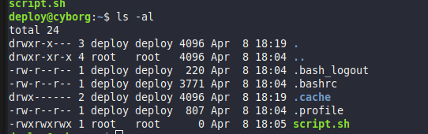

*Figure 22: Post-SSH backend workflow showing the privilege-escalation stage on System 2, consistent with abuse of a root-owned `.sh` file with unsafe permissions.*

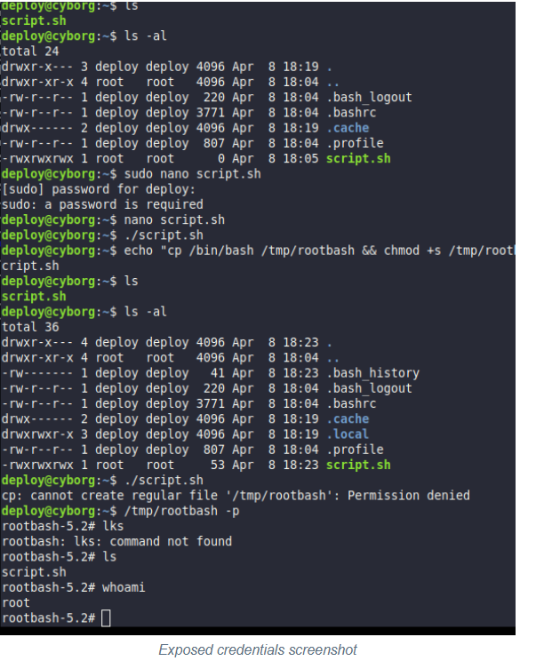

*Figure 23: Additional post-exploitation evidence from the `deploy` foothold on System 2, included to show the backend compromise sequence after SSH access and local privilege escalation.*

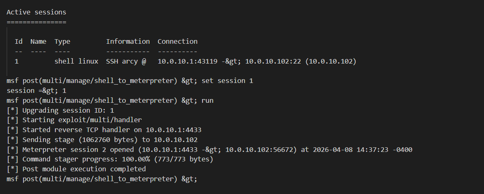

*Figure 24: `shell_to_meterpreter` successfully upgrading the System 2 foothold, demonstrating durable post-exploitation control of `10.0.10.102` after the SSH pivot.*

### 2.9 Phase Seven: Internal Discovery and Windows Service Exploitation on System 3 (`10.0.10.106`)

The final offensive stage in the recorded chain concerns the Windows jump or data-tier host. The operator did not begin with this host as a primary target. It became relevant only after the earlier phases exposed internal topology and service opportunities. That sequencing is important. System 3 was the result of internal discovery, not the initial entry point.

Nmap and service-validation output showed a Windows 10 host with a typical administrative or lateral-movement surface: RPC, NetBIOS, SMB, HTTPAPI, and Icecast. The most decisive finding was the presence of Icecast on port `8000`. Once that service was visible, the attacker performed explicit exploit research, confirmed that Icecast had a known exploitation path, and selected Metasploit's `exploit/windows/http/icecast_header` module.

This phase also matters because it broadens the report beyond web-application risk. By the time the attacker reached System 3, the environment was dealing with classical service exploitation inside a network that had already lost trust separation.

#### Finding Classification

- **Primary Windows hardening finding in formal scans:** PT-04 SMB signing not required on `10.0.10.106`
- **Operational exploitation finding:** reachable Icecast-based RCE path used after internal discovery
- **Host-security interpretation:** internal service exposure and weak host posture lowered attacker cost after the trust boundary had already been breached
- **CWE relevance:** depends on the underlying Icecast vulnerability implementation rather than the pentest narrative itself; the report treats this as confirmed exploitation path selection rather than forcing a speculative CWE assignment without the exact upstream advisory context
- **CVSS handling:** not separately scored in the current report corpus, but operational severity is high because a second executable foothold existed on the Windows side once the attacker had internal visibility

#### Attacker Decision Point

The operator chose Icecast for one reason: it was the cleanest reachable RCE opportunity after internal discovery. That is exactly what an attacker with limited time and clear objectives would do.

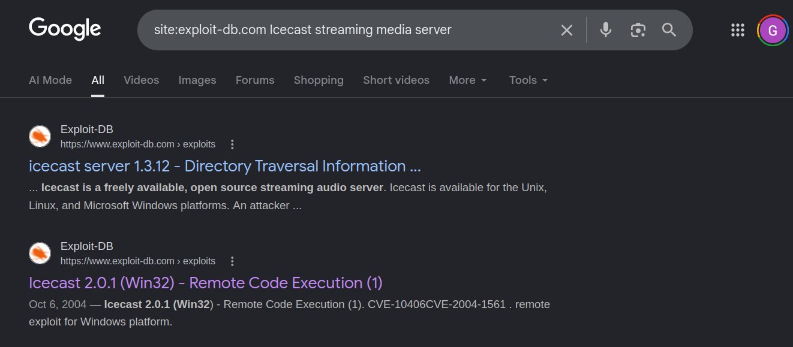

*Figure 25: Windows-host reconnaissance screenshot from the note-tree branch used to guide internal targeting and establish the exposed Windows service surface.*

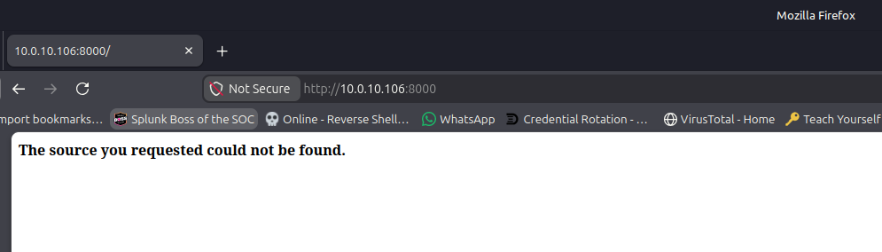

*Figure 26: Follow-on reconnaissance from the Windows-host branch, preserving the pre-exploitation workflow that narrowed attention toward the Icecast service.*

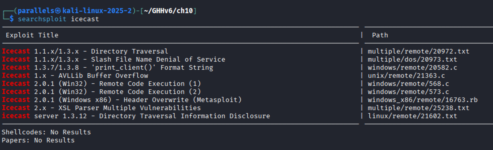

*Figure 27: `searchsploit icecast` output used to confirm that the discovered service on System 3 had a well-known exploitation history, including Windows RCE references.*

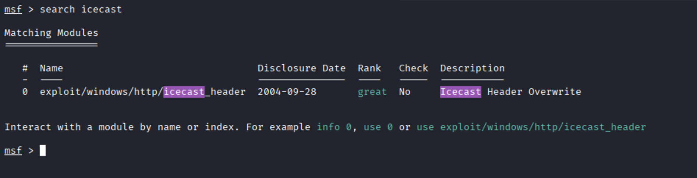

*Figure 28: Metasploit search results identifying `exploit/windows/http/icecast_header`, the module used to convert the Icecast service into remote code execution on System 3.*

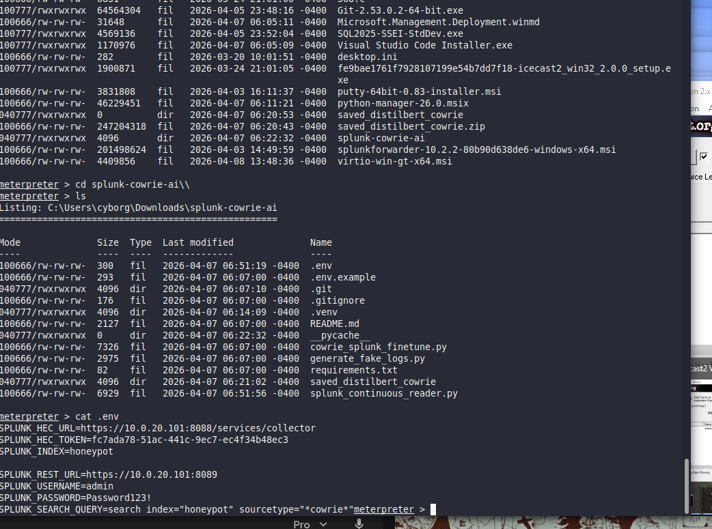

*Figure 29: Post-exploitation evidence from System 3 after the Icecast Metasploit compromise, showing interactive access to files, tooling, and sensitive operational artifacts on the Windows jump server.*

### 2.10 Consolidated Red-Team Findings Matrix

To keep the chapter analytically consistent, the main offensive findings can be summarized as follows.

| ID | Finding | Primary Host | Severity | Framework Lens | CWE | CVSS / Severity Basis |
| --- | --- | --- | --- | --- | --- | --- |
| PT-01 | Insecure file upload leading to remote code execution | `10.0.10.105` | Critical | OWASP A03, A04, A08 | CWE-434 | `9.8` |
| PT-02 | Exposed credentials and internal service secrets | `10.0.10.105` -> `10.0.10.102` | Critical | secret exposure and cross-tier trust failure | CWE-200, CWE-798 | `9.1` |
| PT-03 | Weak web security configuration | `10.0.10.105` | Medium | web hardening weakness | CWE-16 family | `5.3` |
| PT-04 | SMB signing not required | `10.0.10.106` | Medium | Windows hardening issue | Windows hardening issue, Nessus-backed | `5.3` |
| PT-05 to PT-07 | Weak SSH ciphers, KEX, and MACs | `10.0.10.105` | Low | service hardening weakness | service hardening weakness | Nessus low severity |
| PT-08 | ICMP timestamp disclosure | `10.0.10.102`, `10.0.10.106` | Low | information disclosure class | information disclosure class | Nessus low severity |
| OP-01 | Local privilege escalation via root-owned script | `10.0.10.102` | High operational impact | host hardening and privilege management failure | CWE-732 | not separately scored in current corpus |
| OP-02 | Reachable Icecast exploitation path | `10.0.10.106` | High operational impact | internal service exploitation path | service-level exploit path | not separately scored in current corpus |

### 2.11 Red-Team Conclusions

The red-team chapter demonstrates a complete and disciplined offensive progression: reconnaissance, attack-path triage, initial access, credential access, lateral movement, privilege escalation, session stabilization, internal discovery, and downstream exploitation. The most important strategic conclusion is not merely that the web application was vulnerable. It is that the environment allowed a public application flaw to become a multi-system trust failure.

The breach was therefore the product of three layers of weakness working together:

- application insecurity on the public host,
- unsafe credential and secrets placement,
- insufficient containment and hardening once internal access was achieved.

---

## SECTION 3: BLUE/PURPLE TEAM OPERATIONS (THE DEFENSE)

### 3.1 SOC Architecture Summary

The blue-team side of Project Bridgehead should be read as a SOC architecture chapter rather than a generic list of controls. The repository evidence supports a layered defensive design with several distinct functions:

- **perimeter segmentation and control** through pfSense,
- **network-aware detection logic** through the intended Suricata placement on pfSense,
- **deception telemetry** through Cowrie on TCP/2222,
- **centralized SIEM correlation** through Splunk Enterprise in the internal network,
- **host-level monitoring design intent** through Wazuh placement,
- **behavioral enrichment and hunting support** through DistilBERT-based AI classification.

The reason this matters is that the project is not simply “attack happened, logs existed.” It is an engineered attempt to prove how a compact SOC stack can be built around routing, telemetry collection, deception, log aggregation, and enrichment, even inside a small lab.

### 3.2 Sensor Placement and Routing Model

The current architecture evidence supports a clean control narrative.

- pfSense sat at the boundary between WAN, DMZ, and the internal `10.0.20.x` monitoring enclave.
- The DMZ contained the exposed workload hosts and the Cowrie deception surface.
- The internal network contained the main Splunk and Wazuh management roles.

This means telemetry was not supposed to stay on the attack-path hosts. The design intention was for security-relevant events to move off the compromised edge and into the internal SOC zone, where analysts could query them without relying on direct access to the affected system.

Operationally, that routing model gave the team three monitoring advantages:

1. exposed-host logs could be centralized,
2. defensive visibility remained possible even after a DMZ incident,
3. telemetry from Linux, Windows, honeypot, and enrichment workflows could be correlated in one place.

### 3.3 Splunk Architecture and Routing Flows

Splunk is the best-supported SOC component in the repository, and the current evidence supports describing it as the central SIEM and log-analysis platform for the lab.

The routed Splunk model can be summarized like this:

1. **event generation** occurs on DMZ or internal endpoints,
2. **forwarding or ingestion** moves those events toward the internal Splunk deployment,
3. **search and export** via the Splunk REST API makes selected data available to automated enrichment,
4. **re-ingestion** via HEC writes AI-enriched events back into Splunk,
5. **analyst review** happens inside the SOC network through searches, dashboards, and targeted pivots.

Key ports and functions explicitly evidenced in the project materials:

- `9997` for Splunk forwarding workflows,
- `8088` for HEC event insertion,
- `8089` for REST API operations.

This is more important than it first appears. It means the AI pipeline is not a disconnected Jupyter-style exercise. It sits directly in the Splunk routing model by reading events from Splunk and writing enriched results back into Splunk.

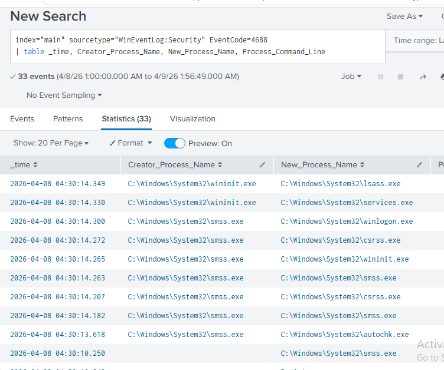

*Figure 32: Splunk monitoring view demonstrating centralized SIEM visibility for blue-team analysis workflows.*

### 3.4 Cowrie Deception Workflow and Event Flow

Cowrie is one of the most operationally valuable controls in the project because it transforms otherwise low-context SSH interaction into a high-context deception stream.

The Cowrie event flow in this environment can be described precisely:

1. an external or internal actor connects to TCP/2222 on `10.0.10.105`,
2. Cowrie emulates an SSH service and records the full session,
3. session metadata, login attempts, client fingerprints, and command inputs are logged,
4. those records become visible to Splunk and, in the AI path, to the DistilBERT enrichment workflow,
5. analysts can distinguish scanner behavior, low-skill credential guessing, and more interactive command execution.

The evidence shows all of these classes. Scanner-style fingerprints such as `TenableRocks`, malformed SSH or TLS-looking handshakes, weak-password login attempts, and command execution traces are all present in the preserved notes or Splunk-aligned outputs.

This control did not prevent the productive compromise path through the web application. But that is not a reason to dismiss it. Its value is in deception, behavioral context, and analyst acceleration. It shows what attackers *do* when they touch the wrong service, and it provides a controlled telemetry stream that is richer than a simple firewall deny log.

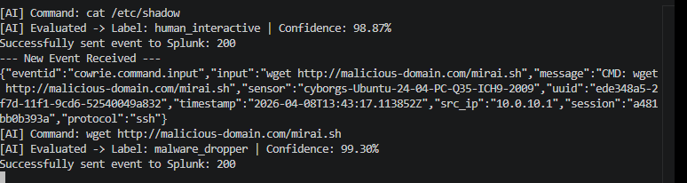

*Figure 30: Splunk view of Cowrie command telemetry after AI enrichment, showing that deceptive SSH interactions were centrally collected rather than left stranded on the honeypot host.*

### 3.5 Wazuh Role Separation and Host-Based Detection Intent

The current repository snapshot is stronger on architecture intent than on preserved Wazuh dashboards, but it still supports a clear description of how Wazuh fit into the SOC design.

The architecture material places:

- Wazuh agents on exposed or DMZ systems,
- Wazuh agents on at least one internal Windows system,
- the Wazuh manager role on the internal monitoring network.

That role separation is important because it mirrors how host-based detection should be deployed in a segmented environment:

- **agents on endpoints** collect host events, persistence indicators, process activity, and integrity data,
- **manager on internal SOC host** aggregates and normalizes that data away from the directly attacked systems,
- **correlation with Splunk** allows host telemetry to sit alongside honeypot and network-context events.

The strongest defensible wording, given the current snapshot, is that Wazuh is a supported part of the designed monitoring stack and host-detection plan, even though the evidence currently preserved in the repository is stronger for Splunk than for dedicated Wazuh dashboards.

### 3.6 Suricata Logic and Perimeter Inspection Value

Suricata should be understood as the network-side control intended to complement both pfSense routing and host-side logs. Where pfSense decides whether a flow is allowed, Suricata provides the possibility of inspecting the flow itself.

In the context of this project, the logic of Suricata is especially important because the decisive exploit traveled over an allowed application channel. A firewall that permits HTTP or HTTPS still needs a way to reason about malicious content within those sessions. That is where Suricata becomes meaningful.

The role of Suricata in this design is therefore:

- inspect allowed traffic between WAN and DMZ,
- inspect sensitive DMZ-to-internal flows where appropriate,
- identify exploit-looking payloads, suspicious headers, and malicious delivery patterns,
- raise alerts that can be correlated with endpoint and honeypot evidence.

The repository does not preserve a full Suricata alert corpus, so the report remains evidence-bounded and does not overclaim dashboard visibility. But architecturally, Suricata is the correct place to address the exact blind spot exposed by the breach: application-layer abuse passing over otherwise approved ports.

### 3.7 Windows and Host Telemetry Through Splunk

Even where dedicated Wazuh evidence is lighter, the current workspace still proves that host telemetry reached the SOC layer. Windows Security Event monitoring is visible through Splunk searches, and that matters because it shows the blue-team stack was not limited to honeypot or Linux-only telemetry.

The Windows event views demonstrate that:

- authentication-related activity was searchable,
- process-related activity was searchable,
- analyst workflows could pivot between honeypot and Windows telemetry within one SIEM context.

This is a meaningful architectural strength. It means the SOC view was already cross-domain: deception events, Windows logs, and later AI labels were being handled in the same environment rather than in isolated tools.

*Figure 31: Splunk statistics over Windows Security Event ID 4625, used to correlate account activity and source network addresses as part of the SOC validation workflow.*

### 3.8 AI Enrichment Workflow and Analyst Value

The DistilBERT pipeline is one of the most technically sophisticated elements in Project Bridgehead, and it should be treated as a first-class SOC capability rather than as an appendix-level novelty.

The enrichment workflow is as follows:

1. Cowrie captures attacker interaction on TCP/2222.
2. Those events are ingested into Splunk.
3. Custom Python scripts query the Splunk REST API for relevant event streams.
4. DistilBERT classifies the command content into attacker-behavior categories.
5. The enriched events are posted back into Splunk using HEC.
6. Analysts consume the resulting behavioral labels as searchable or dashboard-visible context.

The model outputs documented in the repository include:

- `recon_bot`
- `malware_dropper`
- `human_interactive`

The confidence values are operationally meaningful because they are not random annotations. They make it possible to prioritize events that look more like payload staging, hands-on-keyboard exploration, or low-skill reconnaissance.

The project therefore demonstrates an actual enrichment loop, not just model training. That is the key engineering point: the classifier is integrated into the SOC workflow through the Splunk API and HEC path.

*Figure 33: AI-enriched Cowrie telemetry in Splunk, demonstrating that the DistilBERT classifier's outputs were operationalized rather than remaining an offline experiment.*

### 3.9 Detection Successes, Detection Gaps, and Control Reality

The blue-team section should not be read as marketing. Some controls worked well. Others worked only partially. The right interpretation is mixed but strong.

#### Controls That Worked

- Cowrie successfully captured deception-path interaction.
- Splunk successfully centralized multiple telemetry types.
- AI enrichment successfully increased semantic value of SSH command events.
- pfSense segmentation provided a meaningful architectural boundary to reason about.

#### Controls That Did Not Fully Contain the Incident

- the public application remained exploitable at the content-handling layer,
- secret placement on the public host nullified some of the value of segmentation,
- the backend host allowed escalation after valid credential use,
- the Windows service surface still offered internal RCE opportunity.

This is a crucial capstone lesson: detection capability is not the same thing as preventive adequacy. The environment had visibility, but the legacy design still allowed the attacker to move faster than the preventive controls could stop them.

### 3.10 Hardening, Migration, and Secure-State Direction

The post-incident materials are strongest when read as a response to the exact failure chain documented in Section 2. The migration and hardening work addresses not only the upload bug but the trust model that made it dangerous.

#### Upload Remediation

The repository documents a move toward:

- strict server-side validation,
- MIME and parse-level checks,
- image normalization through decode-and-rewrite,
- storage outside the web root,
- authenticated and controlled retrieval,
- CSRF protection,
- permission hardening during deployment.

This is the correct remediation direction for PT-01 because it addresses both the immediate exploit and the unsafe assumptions underneath it.

#### pfSense Rule Hygiene and WAN Exposure Control

The firewall and migration narrative supports tightening of:

- published WAN services,
- DMZ-to-internal flow rules,
- Splunk-specific routing clarity,
- administrative boundary discipline,
- password quality on perimeter control systems.

That matters because segmented networks only work when the published routes and trust paths remain readable, intentional, and minimal.

#### Secure Application Runtime Direction

The secure-state architecture shifts the environment toward:

- Nginx TLS edge behavior,
- Node.js or Express backend over HTTPS,
- MongoDB with TLS and authentication,
- stronger cookie and service-token handling,
- better secrets discipline,
- safer data handling before persistence.

This addresses the exact failure areas exposed during the incident: unsafe upload handling on the public application, weak secrets discipline, exposed services, and the broader trust-boundary problem that made the lateral movement practical.

### 3.11 Blue-Team Conclusions

Project Bridgehead's blue-team side is architecturally credible because it proves a layered design rather than a single defensive trick. The environment combined routing controls, deception, SIEM collection, host-monitoring intent, vulnerability scanning, and machine-learning enrichment. That is the right direction for a real SOC architecture chapter.

The most honest conclusion is therefore this: the SOC stack had meaningful visibility, but the original application and trust design still allowed a critical compromise chain to succeed. The later hardening and migration work are credible precisely because they are aligned to the real failure path rather than to a generic best-practice checklist.

---

## Closing Assessment

Project Bridgehead demonstrates an end-to-end compromise path that begins at a public web application, expands through exposed secrets into an internal backend host, and then opens credible routes toward a Windows data tier. It also demonstrates the foundation of a defensible purple-team response: segmented firewalling, centralized logging, deception telemetry, and AI-assisted hunting tied to a more secure target-state architecture. The central lesson is straightforward: visibility does not compensate for insecure design. The secure-state migration documented in the repository is aligned to the actual failure mode, which is why it represents the correct strategic direction for final remediation.
